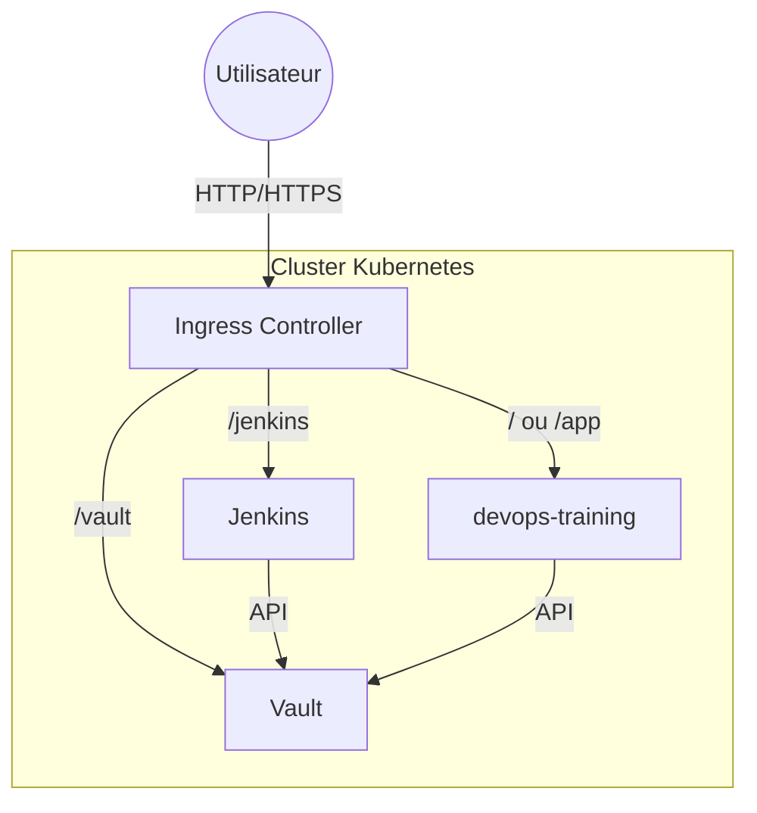

# Kubernetes Manifests - DevOps Training

Bienvenue ! Ce dossier contient tous les fichiers nécessaires pour déployer une plateforme DevOps sur Kubernetes. Ce guide est conçu pour les débutants.

## Sommaire

- [Kubernetes Manifests - DevOps Training](#kubernetes-manifests---devops-training)
  - [Sommaire](#sommaire)
  - [Présentation du dossier](#présentation-du-dossier)
  - [Prérequis](#prérequis)
  - [Structure du dossier](#structure-du-dossier)
  - [Explication des fichiers et concepts Kubernetes](#explication-des-fichiers-et-concepts-kubernetes)
    - [Types de ressources utilisées](#types-de-ressources-utilisées)
    - [Pourquoi ces choix ?](#pourquoi-ces-choix-)
    - [Détail des fichiers](#détail-des-fichiers)
  - [Diagramme d'architecture](#diagramme-darchitecture)
  - [Déploiement rapide](#déploiement-rapide)
  - [Accès aux applications](#accès-aux-applications)
  - [Portabilité](#portabilité)
  - [Pour aller plus loin](#pour-aller-plus-loin)
  - [FAQ (Foire Aux Questions)](#faq-foire-aux-questions)
    - [Je n’arrive pas à accéder à Jenkins ou Vault via l’URL locale](#je-narrive-pas-à-accéder-à-jenkins-ou-vault-via-lurl-locale)
    - [Mon pod ne démarre pas ou reste en CrashLoopBackOff](#mon-pod-ne-démarre-pas-ou-reste-en-crashloopbackoff)
    - [Comment activer HTTPS sur mon Ingress ?](#comment-activer-https-sur-mon-ingress-)
    - [Comment changer le port ou le nom de domaine ?](#comment-changer-le-port-ou-le-nom-de-domaine-)
    - [Comment nettoyer les ressources créées ?](#comment-nettoyer-les-ressources-créées-)
    - [Comment sauvegarder les données Jenkins ?](#comment-sauvegarder-les-données-jenkins-)
    - [Comment builder et déployer automatiquement mon application ?](#comment-builder-et-déployer-automatiquement-mon-application-)
    - [Où trouver plus d’aide ?](#où-trouver-plus-daide-)
  - [Gestion des secrets (important)](#gestion-des-secrets-important)
    - [1. jenkins-casc-secrets](#1-jenkins-casc-secrets)
    - [2. dockerhub-secret](#2-dockerhub-secret)
    - [Fichier d’exemple](#fichier-dexemple)

---

## Présentation du dossier

Ce dossier regroupe les manifestes Kubernetes pour déployer :
- L’application principale (devops-training)
- Jenkins (CI/CD)
- Vault (gestion des secrets)

## Prérequis

- Un cluster Kubernetes (local ou cloud)
- kubectl installé et configuré
- (Optionnel) Un Ingress Controller (nginx, traefik, etc.)

## Structure du dossier

- `devops-training/` : Manifeste de l’application principale
- `jenkins/` : Manifeste Jenkins (déploiement, service, ingress, volume, job Kaniko)
- `vault/` : Manifeste Vault (déploiement, service, ingress)
- `scripts/` : Scripts d’automatisation (déploiement, suppression)

## Explication des fichiers et concepts Kubernetes

### Types de ressources utilisées

- **Deployment** : Permet de déployer et de gérer un ou plusieurs pods (instances de conteneurs). Il gère le nombre de réplicas, les mises à jour et le redémarrage automatique en cas de problème.
- **Service** : Permet d’exposer les pods. Le type `ClusterIP` (utilisé ici) rend le service accessible uniquement à l’intérieur du cluster. C’est le choix par défaut pour la communication interne entre applications.
- **Ingress** : Permet d’exposer les services HTTP/HTTPS vers l’extérieur du cluster, en utilisant un nom de domaine. Il agit comme un routeur d’entrée.
- **PersistentVolumeClaim (PVC)** : Utilisé pour Jenkins afin de stocker les données de manière persistante, même si le pod est redémarré ou supprimé.
- **Job** : Utilisé pour lancer des tâches ponctuelles, comme la construction et le push d’une image Docker avec Kaniko.

### Pourquoi ces choix ?

- **Deployment** : Assure la haute disponibilité et la gestion automatique des pods.
- **Service ClusterIP** : Sécurise l’accès en limitant la visibilité à l’intérieur du cluster. L’accès externe se fait via Ingress.
- **Ingress** : Permet d’utiliser des noms de domaine personnalisés (ex : jenkins.devops.local) et de centraliser la gestion des accès HTTP/HTTPS.
- **PVC pour Jenkins** : Jenkins a besoin de conserver ses données (jobs, plugins, etc.) même après un redémarrage.
- **Job Kaniko** : Permet de builder et pousser des images Docker directement depuis le cluster, sans nécessiter Docker en mode privilégié.

### Détail des fichiers

- `deployment.yaml` : Décrit le déploiement de l’application (image, variables d’environnement, ports, etc.).
- `service.yaml` : Expose l’application à l’intérieur du cluster (type ClusterIP).
- `ingress.yaml` : Route le trafic HTTP/HTTPS vers le service, selon le nom de domaine.
- `jenkins-pvc.yaml` : Réserve un espace de stockage persistant pour Jenkins.
- `kaniko-job.yaml` : Déclenche la construction d’une image Docker avec Kaniko.
- `jenkins-with-kubectl.Dockerfile` : Image Jenkins personnalisée avec kubectl installé.
- `scripts/deploy.sh` et `scripts/delete.sh` : Scripts pour déployer ou supprimer rapidement toute la stack.

## Diagramme d'architecture



## Déploiement rapide

1. Ouvrez un terminal à la racine du projet
2. Appliquez tous les manifestes :

```sh
kubectl apply -f ./k8s/
```

3. Pour supprimer :
```sh
kubectl delete -f ./k8s/
```

## Accès aux applications

- Ajoutez dans votre fichier hosts (Windows : `C:\Windows\System32\drivers\etc\hosts`) :
  - `127.0.0.1 vault.devops.local`
  - `127.0.0.1 jenkins.devops.local`
- Accédez à :
  - http://vault.devops.local:8200
  - http://jenkins.devops.local:8080

> Remplacez l’IP par celle de votre cluster si besoin (ex : minikube ip)

## Portabilité

Les manifestes sont compatibles avec tout cluster Kubernetes standard (local, cloud, etc.), sans dépendance à un fournisseur cloud.

## Pour aller plus loin

- Modifiez les fichiers YAML pour adapter images, variables, ressources…
- Ajoutez d’autres services ou configurations selon vos besoins.
- Consultez la documentation officielle Kubernetes pour approfondir.

## FAQ (Foire Aux Questions)

### Je n’arrive pas à accéder à Jenkins ou Vault via l’URL locale
- Vérifiez que vous avez bien ajouté les entrées dans votre fichier hosts (ex : `127.0.0.1 jenkins.devops.local`).
- Assurez-vous que l’Ingress Controller (nginx, traefik, etc.) est bien installé sur votre cluster.
- Vérifiez que les pods sont en état `Running` avec `kubectl get pods -A`.
- Si vous utilisez Minikube, essayez la commande `minikube tunnel` pour exposer les services LoadBalancer.

### Mon pod ne démarre pas ou reste en CrashLoopBackOff
- Utilisez `kubectl describe pod <nom-du-pod>` pour voir les erreurs d’événements.
- Consultez les logs avec `kubectl logs <nom-du-pod>`.
- Vérifiez que les images sont accessibles et que les variables d’environnement sont correctes.
- Vérifiez que les ressources (CPU/mémoire) ne sont pas trop basses ou trop élevées pour votre cluster.

### Comment activer HTTPS sur mon Ingress ?
- Installez cert-manager ou créez un secret TLS manuellement.
- Ajoutez une section `tls:` dans votre fichier ingress.yaml (voir documentation Kubernetes).
- Exemple :
  ```yaml
  tls:
    - hosts:
        - jenkins.devops.local
      secretName: jenkins-tls
  ```
- Pour générer un certificat auto-signé pour les tests :
  ```sh
  kubectl create secret tls jenkins-tls --cert=chemin/vers/cert.crt --key=chemin/vers/cert.key
  ```

### Comment changer le port ou le nom de domaine ?
- Modifiez le champ `port` dans le service et le deployment.
- Modifiez le champ `host` dans le fichier ingress.yaml.
- Mettez à jour votre fichier hosts si besoin.

### Comment nettoyer les ressources créées ?
- Utilisez `kubectl delete -f ./k8s/` pour supprimer tous les objets créés.
- Utilisez le script `scripts/delete.sh` pour une suppression automatisée.
- Pour supprimer tous les pods en erreur :
  ```sh
  kubectl delete pod --field-selector=status.phase=Failed -A
  ```

### Comment sauvegarder les données Jenkins ?
- Les données Jenkins sont stockées dans un PersistentVolumeClaim (PVC).
- Pour sauvegarder, faites un snapshot du volume ou copiez le contenu du PVC.
- Pour restaurer, montez le PVC sur un nouveau pod Jenkins.

### Comment builder et déployer automatiquement mon application ?
- Utilisez le pipeline Jenkins fourni (voir Jenkinsfile).
- Le job Kaniko permet de builder et pousser l’image Docker à chaque commit.
- Vous pouvez adapter le pipeline pour déployer automatiquement après le build.

### Où trouver plus d’aide ?
- Consultez la documentation officielle Kubernetes : https://kubernetes.io/fr/docs/
- Documentation Jenkins : https://www.jenkins.io/doc/
- Documentation Vault : https://developer.hashicorp.com/vault/docs
- Cherchez sur Stack Overflow ou GitHub Discussions.

## Gestion des secrets (important)

Pour que Jenkins et le pipeline fonctionnent, vous devez créer deux secrets Kubernetes :

### 1. jenkins-casc-secrets
Ce secret contient les identifiants d’admin Jenkins, vos identifiants Docker Hub et le kubeconfig encodé en base64.

Variables attendues :
- ADMIN_USER
- ADMIN_PASSWORD
- DOCKERHUB_USER
- DOCKERHUB_PASSWORD
- KUBECONFIG_BASE64

Exemple de création (sous PowerShell ou Git Bash) :
```sh
kubectl create secret generic jenkins-casc-secrets \ 
  --from-literal=ADMIN_USER=admin \ 
  --from-literal=ADMIN_PASSWORD=admin123 \ 
  --from-literal=DOCKERHUB_USER=ton_user_dockerhub \ 
  --from-literal=DOCKERHUB_PASSWORD=ton_mot_de_passe_dockerhub \ 
  --from-literal=KUBECONFIG_BASE64=base64_de_ton_kubeconfig
```
Pour obtenir le base64 de votre kubeconfig :
```sh
cat ~/.kube/config | base64 -w 0
```
(Sous Windows, utilisez Git Bash ou WSL, ou encodez le fichier avec un outil en ligne.)

### 2. dockerhub-secret
Ce secret permet à Kaniko (ou d’autres pods) de pousser des images sur Docker Hub.

Variables attendues :
- DOCKERHUB_USER
- DOCKERHUB_PASSWORD
- DOCKERHUB_EMAIL

Exemple de création :
```sh
kubectl create secret docker-registry dockerhub-secret \ 
  --docker-username=ton_user_dockerhub \ 
  --docker-password=ton_mot_de_passe_dockerhub \ 
  --docker-email=ton_email
```

### Fichier d’exemple
Créez un fichier `secrets-example.env` (non versionné) pour garder une trace des variables à renseigner :
```
ADMIN_USER=admin
ADMIN_PASSWORD=admin123
DOCKERHUB_USER=ton_user_dockerhub
DOCKERHUB_PASSWORD=ton_mot_de_passe_dockerhub
KUBECONFIG_BASE64=base64_de_ton_kubeconfig
DOCKERHUB_EMAIL=ton_email
```

> Ne versionnez jamais vos vrais secrets ! Utilisez ce fichier comme référence pour onboarder de nouveaux utilisateurs.

---

Bon déploiement !
